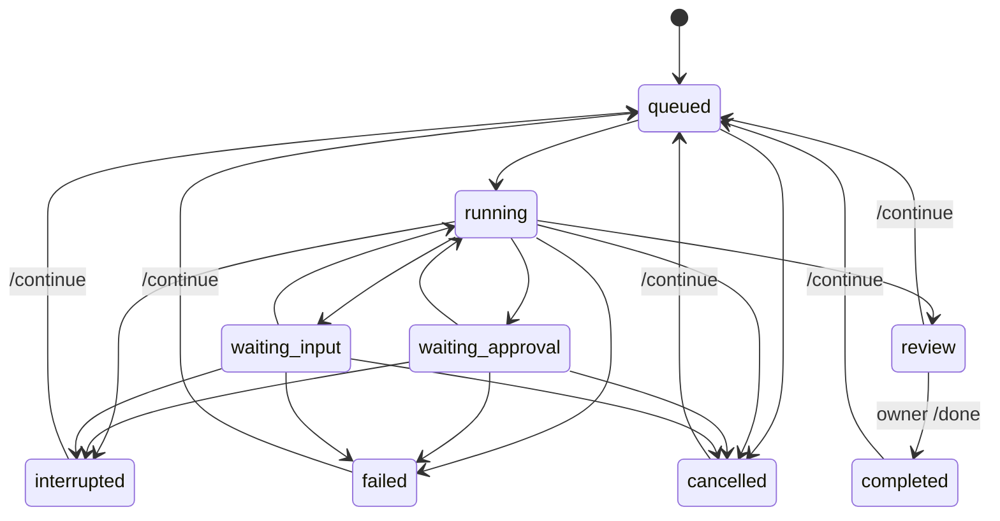

# Architecture and invariants

## Scope

One owner, one local instance, one active execution. The service is a task coordinator around official agent runtimes. It does not implement a model gateway. Transport, orchestration, persistence and execution have separate interfaces.

```text
src/channels/feishu.ts  — official SDK WebSocket events, callbacks and card delivery
src/channels/cards.ts   — Card 2.0 presentation and opaque action issuance
src/engine.ts           — authorization, commands, queue, approval routing, delivery
src/store.ts            — SQLite task/event/inbox/request/outbox records
src/adapters/codex.ts   — task-to-Codex protocol mapping
src/adapters/rpc.ts     — isolated stdio protocol connection per run
src/adapters/demo.ts    — explicitly simulated experience
src/config.ts          — owner and project allowlist validation
src/setup-feishu.ts    — official new-app authorization and private local configuration
src/cli.ts             — terminal demo/local mode, diagnostics and service lifecycle
```

## Domain

- **Task**: durable work owned by a human, scoped to a configured project and originating conversation.
- **Run**: one active invocation of an executor for a task. A continued task reuses its Codex thread.
- **Human request**: one live, process-bound permission or input request, with its own opaque ID.
- **Result**: the executor's report, pending acceptance; not an independent verification certificate.
- **Event**: a local audit/progress record. The database may contain private task content.
- **Delivery**: a persisted message with a stable transport deduplication UUID.

## State machine



When several requests are pending, approvals take display precedence over questions. Resolution of one request does not clear other pending requests. A completed Codex turn may also terminate a run with outstanding nonblocking questions; those requests expire.

## Invariants

1. Reject non-owner, non-human and non-DM inputs before creating work or disclosing task state.
2. Deduplicate inbound messages in the same SQLite transaction as command effects and response enqueueing. Acknowledge the event without waiting for a model or outbound API call.
3. Use an exact project alias, never an arbitrary path supplied by a message.
4. Launch a run only when no other run is active. The state-directory instance lock prevents ordinary duplicate launches.
5. Bind permission/input requests to the active runtime, task and original conversation. Only accept a pending request once. Never reuse old approvals after restart.
6. Send one-shot approval decisions only; do not accept session-wide or policy-amendment grants. If a file approval's changes are unavailable or the description cannot be fully displayed within the configured limit, decline it.
7. Unknown server requests return a protocol error rather than granting permission.
8. On startup, mark in-flight work interrupted and expire requests. Retry outbound messages, not potentially side-effecting executions.
9. A successful turn transitions to `review`; only the owner transitions it to `completed`.
10. Keep the authentication and billing distinction explicit. Check ChatGPT authentication before inference; no fallback provider path exists.

## Protocol and trust boundaries

Onboarding is an explicit operator command, separate from runtime message processing. `setup:feishu` requests a new application through the official SDK; the platform authorization page is the user's confirmation surface. It requests only bot DM receive/send scopes and the message event, though the operator must verify the platform's effective grants. The returned app identity goes into an exclusively created `0600` `.env`, never into logs or a model prompt. Only a valid app-scoped owner returned by that authorization is auto-bound. Missing identity or an unsupported Lark tenant fails closed. Setup holds the local instance lock and never replaces existing credentials. Authorization success is not proof of app publication, a working event subscription, or live-message acceptance.

Codex App Server is launched as a child process over stdio. The adapter performs `initialize`, `account/read`, `thread/start` or `thread/resume`, then `turn/start`. It consumes item/turn notifications and forwards supported approval and user-input requests. Each run closes its runtime connection on completion or cancellation. On macOS/Linux the child has its own process group, which is terminated before another run is dispatched. This cannot undo external side effects or stop a process that deliberately escapes the group.

The adapter uses explicit sandbox and approval settings, but the official Codex installation retains its own local configuration, extensions, credentials and thread storage. Steward's instructions about Git and publishing are behavioral guidance, not a universal action firewall. Respect repository protections and use trusted environments.

SQLite is the record of work; Codex owns the model session. There is no cross-provider context migration yet. The task service must eventually create an explicit handoff document to switch executors; it cannot assume session IDs are portable.

## Failure and delivery semantics

The outbox persists before delivery and uses bounded exponential backoff. The transport receives the same UUID on retry. A crash after remote success but before local acknowledgement can duplicate delivery outside the provider's deduplication window. No exactly-once network-delivery claim is made.

Run timeout includes human waiting time. Failed or cancelled executions retain any changes they already made. A thread that cannot be resumed fails visibly; starting a replacement thread is not automatic. Codex rate-limit errors currently surface as failures requiring a later explicit continuation; quota-aware scheduling is planned.

An instance lock is local to one filesystem and PID namespace. Do not share state storage across containers or hosts. Local SQLite/events and Codex session storage require separate private backups. Schema v2 adds an optional outbox view, durable card message identities and expiring action capabilities without dropping v1 data. Expired action capabilities are pruned when rendering new controls. Other automatic retention is not implemented.

## Implementation choices

- TypeScript + Node 24: one language with official Feishu SDK integration and native SQLite.
- SQLite: durable local operation without requiring a database service.
- WebSocket Feishu transport: outbound connection, no public webhook server in the initial version.
- Feishu Card 2.0: forms, state-specific controls, paged lists/results and task-card updates. Terminal commands remain a fallback.
- MIT license: simple reuse for people deploying their own agents.

## References

- [Codex App Server](https://learn.chatgpt.com/docs/app-server)
- [Codex authentication](https://learn.chatgpt.com/docs/auth)
- [Official Feishu Node SDK](https://github.com/larksuite/node-sdk)
- [A2A concepts](https://a2a-protocol.org/latest/topics/key-concepts/) — future interoperability, not implemented

## Card interaction and delivery

`View` is a semantic outbox reference, not serialized display text parsed back into business state. Feishu renders current database state at delivery time. Each control holds an opaque random capability persisted with its intended operation and originating DM; no callback-provided command is executed. Only the configured owner and matching chat may use it. Mutation capabilities are single-use and committed with the task mutation in the inbound transaction. Task revision checks reject stale buttons; approval/input actions also require the exact pending in-memory request. Form validation occurs before consuming its capability. Capabilities expire after seven days; “工作台” opens fresh controls. Task revisions advance monotonically even within one millisecond.

The callback acknowledges after local synchronous validation/receipt, without waiting for a model or message API. Result acceptance remains an explicit owner action. Approval descriptions are never truncated beside an accept button: descriptions exceeding the display budget get a decline-only card. Untrusted task/result text is rendered as plain text so model-generated mention/markup cannot become card controls. Long results are paginated rather than discarded.

Task message identities persist across restarts. Routine refreshes patch the latest task card. Because patches alone do not create unread notifications, a waiting-for-human, review, failed or interrupted revision gets one fresh card, then subsequent refreshes patch it. As with text delivery, remote success followed by a crash before local acknowledgement relies on Feishu’s finite UUID deduplication window. Patch failures remain retryable, without silently creating duplicate cards. Recalled/uneditable cards may require operator repair of their local message mapping; this preview does not yet automatically classify permanent patch errors.

The recent-task list covers the latest 20 tasks with three per page. Form inputs are limited to 1,000 characters; text commands retain the 16,000-character inbound limit. Only the first pending human request is displayed; resolving it refreshes the task card to expose any remaining request. Local terminal output uses the existing text fallback. Card callback subscription is a deployment prerequisite, not proved by a successful WebSocket start or card send.

Explicit card navigation targets the message that was clicked, rather than a cached view elsewhere in chat history. After a successful update, the message is rebound to its new view so background task updates cannot overwrite a form. Typed workbench/list/status requests create a fresh visible card and retain a per-delivery identity for retry deduplication.

Task lists use full-width clickable rows with shared semantic status labels, symbols and colors (blue running, orange human attention/interruption, purple review, green accepted, red failed, grey queued/stopped). Titles use plain text with a two-line limit; project metadata is secondary. Only fixed status strings use card markup. Row callbacks use the same opaque navigation capabilities and clicked-message targeting as buttons.


## Isolated project delivery (schema v3)

Project sandbox is a maximum capability; task mode defaults to read-only and is immutable across continuation. `workspace-write` configuration requires a worktree definition. Existing v2 tasks migrate to read-only without losing sessions, card actions or outbox data. V3 adds task `mode` / `nextAction` and durable workspace / delivery records.

`WorkspaceExecutor` wraps the official runtime. A configured Git project gets `steward/<task-id>` at the resolved base SHA, under the private state directory. Workspace identity is saved before Git mutation; reuse checks repository, branch, real path and base ancestry. The primary checkout is never the write working directory. Existing sessions cannot silently recreate a lost worktree. Interrupted tasks retain worktrees and need explicit continuation; automatic cleanup is not implemented.

After the runtime returns, the wrapper inventories tracked and untracked changes and runs operator-configured checks as separate local processes. Logs are bounded and private; stdout is not treated as instructions. Exit codes and a content fingerprint, plus a hash of check configuration, bind the result to the actual delivery. Checks that change delivery files invalidate readiness. A failed check still leaves a reviewable task, with publication unavailable. Model prose never substitutes for check evidence.

Publication has no model turn: the owner confirms an opaque, revision-bound card action after seeing the repository and PR text. The durable queue records `nextAction=publish` and uses the same serial slot, timeout and cancellation controls as execution. The publisher verifies origin identity, current content and target SHA; stages explicit paths, commits, pushes only the task branch without force, creates or updates a draft PR, and reads back head SHA/base/state/URL. Existing closed or merged PRs and moved target branches stop publication. Unknown create outcomes query existing PRs before another attempt. Only verified GitHub URLs appear as delivery links. No automatic merge or deployment is performed. Cancelling after a remote side effect cannot undo that effect.

This is local workflow control, not an OS isolation boundary. Checks execute trusted project code as the local user; they receive a minimal environment but retain filesystem/network access. Codex still uses its configured tools and MCP servers. The agent receives instructions to leave commit/push/PR actions to the publisher, but branch protections remain necessary. Modified files and validation logs are separate from browser acceptance, GitHub CI and human acceptance.
