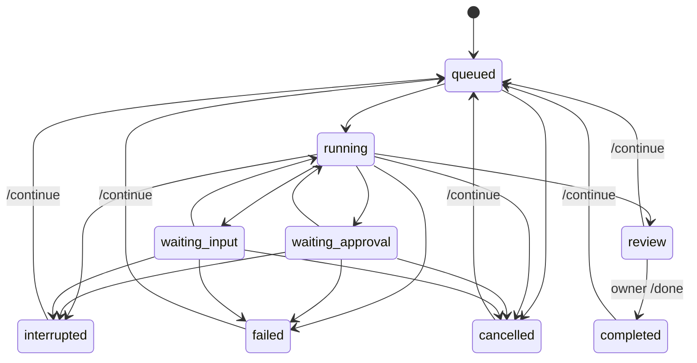

# Architecture and invariants

## Scope

One owner, one local instance, one active execution. The service is a task coordinator around official agent runtimes. It does not implement a model gateway. Transport, orchestration, persistence and execution have separate interfaces.

```text
src/channels/feishu.ts  — official SDK WebSocket events and outbound messages
src/engine.ts           — authorization, commands, queue, approval routing, delivery
src/store.ts            — SQLite task/event/inbox/request/outbox records
src/adapters/codex.ts   — task-to-Codex protocol mapping
src/adapters/rpc.ts     — isolated stdio protocol connection per run
src/adapters/demo.ts    — explicitly simulated experience
src/config.ts          — owner and project allowlist validation
src/setup-feishu.ts    — official new-app authorization and private local configuration
src/cli.ts             — terminal demo/local mode, diagnostics and service lifecycle
```

## Domain

- **Task**: durable work owned by a human, scoped to a configured project and originating conversation.
- **Run**: one active invocation of an executor for a task. A continued task reuses its Codex thread.
- **Human request**: one live, process-bound permission or input request, with its own opaque ID.
- **Result**: the executor's report, pending acceptance; not an independent verification certificate.
- **Event**: a local audit/progress record. The database may contain private task content.
- **Delivery**: a persisted message with a stable transport deduplication UUID.

## State machine



When several requests are pending, approvals take display precedence over questions. Resolution of one request does not clear other pending requests. A completed Codex turn may also terminate a run with outstanding nonblocking questions; those requests expire.

## Invariants

1. Reject non-owner, non-human and non-DM inputs before creating work or disclosing task state.
2. Deduplicate inbound messages in the same SQLite transaction as command effects and response enqueueing. Acknowledge the event without waiting for a model or outbound API call.
3. Use an exact project alias, never an arbitrary path supplied by a message.
4. Launch a run only when no other run is active. The state-directory instance lock prevents ordinary duplicate launches.
5. Bind permission/input requests to the active runtime, task and original conversation. Only accept a pending request once. Never reuse old approvals after restart.
6. Send one-shot approval decisions only; do not accept session-wide or policy-amendment grants. If a file approval's changes are unavailable or the description cannot be fully displayed within the configured limit, decline it.
7. Unknown server requests return a protocol error rather than granting permission.
8. On startup, mark in-flight work interrupted and expire requests. Retry outbound messages, not potentially side-effecting executions.
9. A successful turn transitions to `review`; only the owner transitions it to `completed`.
10. Keep the authentication and billing distinction explicit. Check ChatGPT authentication before inference; no fallback provider path exists.

## Protocol and trust boundaries

Onboarding is an explicit operator command, separate from runtime message processing. `setup:feishu` requests a new application through the official SDK; the platform authorization page is the user's confirmation surface. It requests only bot DM receive/send scopes and the message event, though the operator must verify the platform's effective grants. The returned app identity goes into an exclusively created `0600` `.env`, never into logs or a model prompt. Only a valid app-scoped owner returned by that authorization is auto-bound. Missing identity or an unsupported Lark tenant fails closed. Setup holds the local instance lock and never replaces existing credentials. Authorization success is not proof of app publication, a working event subscription, or live-message acceptance.

Codex App Server is launched as a child process over stdio. The adapter performs `initialize`, `account/read`, `thread/start` or `thread/resume`, then `turn/start`. It consumes item/turn notifications and forwards supported approval and user-input requests. Each run closes its runtime connection on completion or cancellation. On macOS/Linux the child has its own process group, which is terminated before another run is dispatched. This cannot undo external side effects or stop a process that deliberately escapes the group.

The adapter uses explicit sandbox and approval settings, but the official Codex installation retains its own local configuration, extensions, credentials and thread storage. Steward's instructions about Git and publishing are behavioral guidance, not a universal action firewall. Respect repository protections and use trusted environments.

SQLite is the record of work; Codex owns the model session. There is no cross-provider context migration yet. The task service must eventually create an explicit handoff document to switch executors; it cannot assume session IDs are portable.

## Failure and delivery semantics

The outbox persists before delivery and uses bounded exponential backoff. The transport receives the same UUID on retry. A crash after remote success but before local acknowledgement can duplicate delivery outside the provider's deduplication window. No exactly-once network-delivery claim is made.

Run timeout includes human waiting time. Failed or cancelled executions retain any changes they already made. A thread that cannot be resumed fails visibly; starting a replacement thread is not automatic. Codex rate-limit errors currently surface as failures requiring a later explicit continuation; quota-aware scheduling is planned.

An instance lock is local to one filesystem and PID namespace. Do not share state storage across containers or hosts. Local SQLite/events and Codex session storage require separate private backups. Automatic retention and migrations beyond schema v1 are not implemented.

## Implementation choices

- TypeScript + Node 24: one language with official Feishu SDK integration and native SQLite.
- SQLite: durable local operation without requiring a database service.
- WebSocket Feishu transport: outbound connection, no public webhook server in the initial version.
- Text commands: concrete task/request correlation before adding richer cards and natural-language routing.
- MIT license: simple reuse for people deploying their own agents.

## References

- [Codex App Server](https://learn.chatgpt.com/docs/app-server)
- [Codex authentication](https://learn.chatgpt.com/docs/auth)
- [Official Feishu Node SDK](https://github.com/larksuite/node-sdk)
- [A2A concepts](https://a2a-protocol.org/latest/topics/key-concepts/) — future interoperability, not implemented
