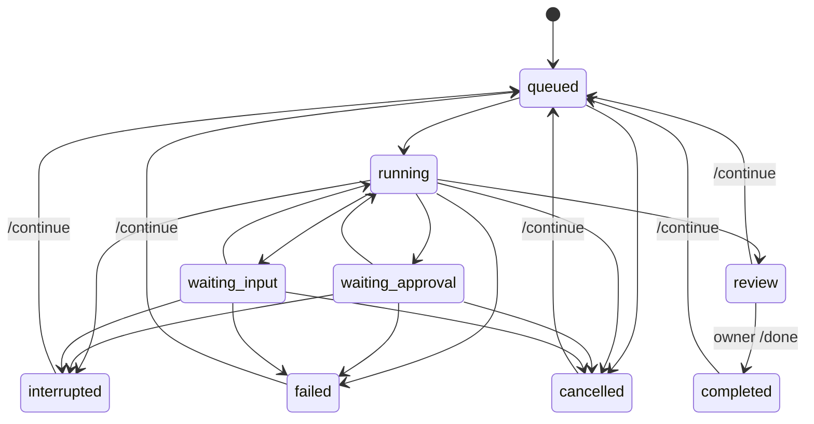

# Architecture and invariants

## Scope

One owner, one local instance, one active execution. The service is a task coordinator around official agent runtimes. It does not implement a model gateway. Transport, orchestration, persistence and execution have separate interfaces.

```text
src/channels/feishu.ts  — official SDK WebSocket events, callbacks and card delivery
src/channels/cards.ts   — Card 2.0 presentation and opaque action issuance
src/engine.ts           — authorization, commands, queue, approval routing, delivery
src/store.ts            — SQLite task/event/inbox/request/outbox records
src/adapters/codex.ts   — task-to-Codex protocol mapping
src/adapters/rpc.ts     — isolated stdio protocol connection per run
src/adapters/demo.ts    — explicitly simulated experience
src/config.ts          — owner and project allowlist validation
src/setup-feishu.ts    — official new-app authorization and private local configuration
src/cli.ts             — terminal demo/local mode, diagnostics and service lifecycle
```

## Domain

- **Task**: durable work owned by a human, scoped to an authorized Codex project or a projectless conversation.
- **Run**: one active invocation of an executor for a task. A continued task reuses its Codex thread.
- **Human request**: one live, process-bound permission or input request, with its own opaque ID.
- **Result**: the executor's report, pending acceptance; not an independent verification certificate.
- **Event**: a local audit/progress record. The database may contain private task content.
- **Delivery**: a persisted message with a stable transport deduplication UUID.

## State machine



When several requests are pending, approvals take display precedence over questions. Resolution of one request does not clear other pending requests. A completed Codex turn may also terminate a run with outstanding nonblocking questions; those requests expire.

## Invariants

1. Reject non-owner and non-human inputs before creating work or disclosing task state. Group mode is opt-in and requires an exact bot mention or a previously bound topic.
2. Deduplicate inbound messages in the same SQLite transaction as command effects and response enqueueing. Acknowledge the event without waiting for a model or outbound API call.
3. Use an exact project alias, never an arbitrary path supplied by a message.
4. Launch a run only when no other run is active. The state-directory instance lock prevents ordinary duplicate launches.
5. Bind permission/input requests to the active runtime, task and original conversation. Only accept a pending request once. Never reuse old approvals after restart.
6. Send one-shot approval decisions only; do not accept session-wide or policy-amendment grants. If a file approval's changes are unavailable or the description cannot be fully displayed within the configured limit, decline it.
7. Unknown server requests return a protocol error rather than granting permission.
8. On startup, mark in-flight work interrupted and expire requests. Retry outbound messages, not potentially side-effecting executions.
9. A successful turn transitions to `review`; only the owner transitions it to `completed`.
10. Keep the authentication and billing distinction explicit. Check ChatGPT authentication before inference; no fallback provider path exists.

## Protocol and trust boundaries

Onboarding is an explicit operator command, separate from runtime message processing. `setup:feishu` requests a new application through the official SDK; the platform authorization page is the user's confirmation surface. It requests only bot DM receive/send scopes and the message event, though the operator must verify the platform's effective grants. The returned app identity goes into an exclusively created `0600` `.env`, never into logs or a model prompt. Only a valid app-scoped owner returned by that authorization is auto-bound. Missing identity or an unsupported Lark tenant fails closed. Setup holds the local instance lock and never replaces existing credentials. Authorization success is not proof of app publication, a working event subscription, or live-message acceptance.

Codex App Server is launched as a child process over stdio. The adapter performs `initialize`, `account/read`, `thread/start` or `thread/resume`, then `turn/start`. It consumes item/turn notifications and forwards supported approval and user-input requests. Each run closes its runtime connection on completion or cancellation. On macOS/Linux the child has its own process group, which is terminated before another run is dispatched. This cannot undo external side effects or stop a process that deliberately escapes the group.

The adapter uses explicit sandbox and approval settings, but the official Codex installation retains its own local configuration, extensions, credentials and thread storage. Steward's instructions about Git and publishing are behavioral guidance, not a universal action firewall. Respect repository protections and use trusted environments.

SQLite is the record of work; Codex owns the model session. There is no cross-provider context migration yet. The task service must eventually create an explicit handoff document to switch executors; it cannot assume session IDs are portable.

## Failure and delivery semantics

The outbox persists before delivery and uses bounded exponential backoff. The transport receives the same UUID on retry. A crash after remote success but before local acknowledgement can duplicate delivery outside the provider's deduplication window. No exactly-once network-delivery claim is made.

Run timeout includes human waiting time. Failed or cancelled executions retain any changes they already made. A thread that cannot be resumed fails visibly; starting a replacement thread is not automatic. Codex rate-limit errors currently surface as failures requiring a later explicit continuation; quota-aware scheduling is planned.

An instance lock is local to one filesystem and PID namespace. Do not share state storage across containers or hosts. Local SQLite/events and Codex session storage require separate private backups. Schema v2 adds an optional outbox view, durable card message identities and expiring action capabilities without dropping v1 data. Expired action capabilities are pruned when rendering new controls. Other automatic retention is not implemented.

## Implementation choices

- TypeScript + Node 24: one language with official Feishu SDK integration and native SQLite.
- SQLite: durable local operation without requiring a database service.
- WebSocket Feishu transport: outbound connection, no public webhook server in the initial version.
- Feishu Card 2.0: forms, state-specific controls, paged lists/results and task-card updates. Terminal commands remain a fallback.
- MIT license: simple reuse for people deploying their own agents.

## References

- [Codex App Server](https://learn.chatgpt.com/docs/app-server)
- [Codex authentication](https://learn.chatgpt.com/docs/auth)
- [Official Feishu Node SDK](https://github.com/larksuite/node-sdk)
- [A2A concepts](https://a2a-protocol.org/latest/topics/key-concepts/) — future interoperability, not implemented

## Card interaction and delivery

`View` is a semantic outbox reference, not serialized display text parsed back into business state. Feishu renders current database state at delivery time. Each control holds an opaque random capability persisted with its intended operation and originating conversation; no callback-provided command is executed. Only the configured owner and matching chat may use it. Mutation capabilities are single-use and committed with the task mutation in the inbound transaction. Task revision checks reject stale buttons; approval/input actions also require the exact pending in-memory request. Form validation occurs before consuming its capability. Capabilities expire after seven days; “工作台” opens fresh controls. Task revisions advance monotonically even within one millisecond.

The callback acknowledges after local synchronous validation/receipt, without waiting for a model or message API. Result acceptance remains an explicit owner action. Approval descriptions are never truncated beside an accept button: descriptions exceeding the display budget get a decline-only card. Untrusted task/result text is rendered as plain text so model-generated mention/markup cannot become card controls. Long results are paginated rather than discarded.

Task message identities persist across restarts. Routine refreshes patch the latest task card. Because patches alone do not create unread notifications, a waiting-for-human, review, failed or interrupted revision gets one fresh card, then subsequent refreshes patch it. As with text delivery, remote success followed by a crash before local acknowledgement relies on Feishu’s finite UUID deduplication window. Patch failures remain retryable, without silently creating duplicate cards. Recalled/uneditable cards may require operator repair of their local message mapping; this preview does not yet automatically classify permanent patch errors.

The recent-task list covers the latest 20 tasks with three per page. Form inputs are limited to 1,000 characters; text commands retain the 16,000-character inbound limit. Only the first pending human request is displayed; resolving it refreshes the task card to expose any remaining request. Local terminal output uses the existing text fallback. Card callback subscription is a deployment prerequisite, not proved by a successful WebSocket start or card send.

Explicit card navigation targets the message that was clicked, rather than a cached view elsewhere in chat history. After a successful update, the message is rebound to its new view so background task updates cannot overwrite a form. Typed workbench/list/status requests create a fresh visible card and retain a per-delivery identity for retry deduplication.

Task lists use full-width clickable rows with shared semantic status labels, symbols and colors (blue running, orange human attention/interruption, purple review, green accepted, red failed, grey queued/stopped). Titles use plain text with a two-line limit; project metadata is secondary. Only fixed status strings use card markup. Row callbacks use the same opaque navigation capabilities and clicked-message targeting as buttons.


## Isolated project delivery (schema v3)

Project sandbox is a maximum capability; task mode defaults to read-only and is immutable across continuation. `workspace-write` configuration requires a worktree definition. Existing v2 tasks migrate to read-only without losing sessions, card actions or outbox data. V3 adds task `mode` / `nextAction` and durable workspace / delivery records.

`WorkspaceExecutor` wraps the official runtime. A configured Git project gets `steward/<task-id>` at the resolved base SHA, under the private state directory. Workspace identity is saved before Git mutation; reuse checks repository, branch, real path and base ancestry. The primary checkout is never the write working directory. Existing sessions cannot silently recreate a lost worktree. Interrupted tasks retain worktrees and need explicit continuation; automatic cleanup is not implemented.

After the runtime returns, the wrapper inventories tracked and untracked changes and runs operator-configured checks as separate local processes. Logs are bounded and private; stdout is not treated as instructions. Exit codes and a content fingerprint, plus a hash of check configuration, bind the result to the actual delivery. Checks that change delivery files invalidate readiness. A failed check still leaves a reviewable task, with publication unavailable. Model prose never substitutes for check evidence.

Publication itself has no model turn: the owner confirms an opaque, revision-bound card action after seeing the repository and PR text. The durable queue records `nextAction=publish` and uses the same serial slot, timeout and cancellation controls as execution. The publisher verifies origin identity, current content and target SHA; stages explicit paths, commits, pushes only the task branch without force, creates or updates a draft PR, and reads back head SHA/base/state/URL. Existing closed or merged PRs and moved target branches stop publication. Unknown create outcomes query existing PRs before another attempt. Only verified GitHub URLs appear as delivery links. No automatic merge or deployment is performed. Cancelling after a remote side effect cannot undo that effect.

Write-capable project turns use the existing App Server final `outputSchema` to return ordinary `message` prose and a nullable `publication` proposal with `repository` and `baseBranch`. The same executor understands natural requests (including edits followed by PR delivery) using the owner prompt and session; no additional classifier or fixed phrase is required. Empty target fields use the project's configured destination. Negations, explanatory questions, quoted context and generic affirmatives are not publication authorization. The adapter validates the complete structured response only after successful, non-cancelled completion and never exposes final routing JSON as progress. Unsupported/malformed output fails visibly without a proposal.

After the workspace wrapper finishes its independent checks, Engine verifies the project grant is unchanged and atomically persists the task result, proposal audit event and publication preview in the existing durable outbox. The requested target is pinned in that view and checked again when the card renders, so a different repository/base produces a concrete blocker instead of silently changing the destination. Missing configuration and failed validation likewise render a blocker. A proposal never sets an authorization key, queues publication, grants access, changes configuration or merges a PR; the existing owner-bound revision/content confirmation remains the only publication authorization path. Failed/cancelled turns discard proposals. There is no new task state or automatic replay after restart. The exact `创建 PR` shortcut still opens the preview without a model turn.

This is local workflow control, not an OS isolation boundary. Checks execute trusted project code as the local user; they receive a minimal environment but retain filesystem/network access. Codex still uses its configured tools and MCP servers. The agent receives instructions to leave commit/push/PR actions to the publisher, but branch protections remain necessary. Modified files and validation logs are separate from browser acceptance, GitHub CI and human acceptance.


## Conversation routing and reference context (schema v4)

Group intake is enabled only with `groupChats: true`. Startup resolves the bot identity through the official bot-info API; failure disables group intake while retaining private chat. Mention detection uses event metadata matched to the bot open_id, never a text substring. Other members and bot-authored events are dropped before routing or context requests. Ordinary owner group chatter, including in bound topics, is ignored unless it mentions this bot, directly replies to a persisted outbound bot message, or answers exactly one pending input request in that topic. Replies addressed to others are ignored. Outbound IDs are checked against the chat-scoped message ledger, not topic membership or model classification.

V4 adds task conversation metadata, context snapshots and `(chatId,messageKey)` task bindings, retaining all v3 data. Conversation records preserve an immutable anchor plus the current source, quote, topic and cutoff. One topic has one current task; source and outgoing message IDs resolve to that task. When the owner explicitly names a different authorized project after execution stops, an atomic handoff creates a fresh task/session for that project and moves the topic bindings. Old tasks, worktrees and deliveries remain intact, while old mutation controls expire; late outgoing messages also resolve to the current task. Codex thread IDs remain distinct from Feishu thread IDs. Natural owner follow-ups resume only a stopped task in that topic; running tasks are not duplicated, and ordinary affirmative text never answers a permission request. Exactly one pending input question may accept an owner text reply.

Group form/navigation capabilities carry a server-issued conversation origin. Callback fields cannot replace it. Home/list card cache keys include the anchor; background updates cannot overwrite another topic. New outbound group cards use message.reply with reply_in_thread=true and stable delivery UUIDs, while patch targeting remains message-specific. Controls remain owner-only, but group card contents are visible to the group audience.

Context I/O happens in the serial execution slot, outside the callback acknowledgement transaction. The adapter verifies source/root/quote membership and reads the exact topic or bounded recent group history. Thread failures never fall back to the full group. The cutoff excludes later messages, and bounds apply to pages, records and characters. Message media is selected from the verified source, pinned root/quote and selected history. PNG/JPEG/WebP resources are bounded, privately downloaded via the message-resource API and attached as Codex localImage inputs. Bounded UTF-8 text attachments are included as untrusted data. PDFs provide bounded text and page renders (including scanned pages); video provides timestamped sampled frames and a local Whisper audio transcript; audio provides a local timestamped transcript. Partial coverage and ASR limitations are explicit. Office, failed and oversized resources stay unread. Native localAudio was not usable with the tested subscription model, so there is no direct-audio or paid API fallback. Conversion commands have bounded time/output, scrubbed credentials, fixed arguments and local-only FFmpeg protocols/demuxers; they are not an additional OS sandbox. Card text is visible-only, never controls or card image downloads. Image temp directories are cleaned on success/failure/cancellation; process crashes may leave directories for offline cleanup. See media.md for dependencies, setup, model checksum and limits. The snapshot is stored privately and supplied to Codex as explicitly untrusted reference data; it never changes the owner's task prompt, mode or approval state. History read failures stop inference. Individual attachment failures carry unread status without silently claiming access. Continuation refreshes the snapshot; publishing an already-reviewed PR does not need another context read.


## Natural dispatch and workspace grants

`npm run workspaces` reads local Codex identities/names/roots via the official `project/list` API, including pagination. Its ten-second snapshot never grants access. The registry no longer imports arbitrary directories or the old workspace catalog. Revision checks include the Codex catalog, so identity/root changes invalidate saves. New grants remain explicit. Duplicate roots preserve separate project identity; multi-root projects currently authorize only the primary root. Existing worktree/check/publication settings are retained for matching grants.

At startup a successful catalog read migrates uniquely matched legacy grants to durable Codex IDs, removes non-Codex projects/defaults and writes a private backup before atomic replacement. Metadata failure never triggers this migration. Runtime reload filters grants against identity and path, so disappearance or discovery failure disables code dispatch and interrupts incompatible active work. A later same-path project with another ID does not inherit authorization. The console retains loopback, Host, same-origin and nonce protection.

Projectless conversations use an internal `__conversation__` task scope, not a configurable project. They run in private OS temporary scratch space with read-only sandbox and no escalation, regardless of the global permission preference. They can consume existing message/attachment context; instructions forbid repository exploration or treating scratch cwd as a project. No code source receipt is emitted. Code-intent requests without an explicit known project ask for a choice; no default or sole-project fallback exists. Names of known unauthorized Codex projects trigger an authorization explanation before inference. Routing remains conservative name/alias and intent matching, not unrestricted semantic routing.

Project-bound new Codex threads carry `projectId`; continuations preserve their session and mode. Explicit cross-project handoff creates a new task/session and keeps existing work. Projectless-to-code handoff carries the owner's original request, not model-generated authority. Unknown/removed project continuations stop rather than switching to scratch space. Owner, topic, one-shot choice and approval invariants remain unchanged.

### Project confirmation in ordinary topic replies (schema v7)

Projectless group turns with authorized candidates use the App Server final `outputSchema` to return user-facing `message` and an optional exact candidate `projectId` (empty for ordinary conversation). This lets the executor identify a likely project from the request, screenshots and reference context even when keyword intake classified it as conversation. The adapter validates the response and emits a proposal hook only after a successful turn; free-form prose is never parsed as project authority. Unsupported or malformed structured output fails without assigning a workspace. Direct messages retain their existing explicit-name/command routing.

Engine validates the grant, appends its own project confirmation question, and atomically stores the result, outbound question and a `project_selections` record bound to the task revision and grant fingerprint. A proposal does not run code or grant new access. A narrow affirmative answer from the owner in that same topic consumes it once and atomically hands off to a new task/session using the configured natural mode. Original owner requirements and subsequent supplements are carried forward; topic/attachment anchors remain intact. No model-authored plan or other participant's message becomes the task prompt.

The pending selection survives restart in review state and does not occupy the executor slot. Rejection clears it, an explicit alternative project takes the normal handoff path, and unrelated continuation replaces it. Task revision changes, removed/replaced grants and active permission requests cannot authorize a handoff. Configuration reload invalidates affected proposals. Generic affirmatives without a saved project selection retain existing behavior and never approve tool permissions, publication, baseline changes or PR merges. Existing tasks with prose-only questions are not retroactively assigned projects or replayed on upgrade.

For group execution, an OnIt reaction on the triggering message precedes context fetching and inference. Its ID is persisted to avoid repeating acknowledged messages. Failed acknowledgement falls back to a brief threaded notice without blocking execution. Routine queued/running cards are suppressed; results, failures, questions, approvals and explicitly requested status cards retain the durable outbox. This reaction is an acknowledgement, not a continually synchronized status or proof of completed work. Serially queued tasks receive it when they start running.

Group conclusions, ordinary questions and failures use full thread post messages instead of task cards. Markdown is rendered with Feishu post md; HTML-like mention syntax is escaped and remote images are not fetched. Long answers split by encoded byte budget, with stable per-chunk delivery IDs within the Feishu 50-character limit and persisted message IDs for partial retries. Reply messages bind back to the task. Internal review state and explicit permission/publication controls remain; ordinary analysis no longer asks the user to click acceptance buttons.

Feishu prose normalizes inline local file links into non-clickable code references before splitting messages. Paths within the recorded task worktree or configured project become project-relative and retain line locations; unknown absolute roots are shortened to filenames. Web/PR links and literal code examples remain unchanged. This does not publish files or infer remote GitHub URLs for unpublished work. The original executor result stays in the local task record.

## Task baseline replacement and MCP confirmations

A stopped Git task can queue a `baseline` action with a user-specified ref (`baselineRef`, schema v5). It uses the existing serial execution slot and owner-bound one-shot approval path. Preparation records exact source/base SHA and old inventory; approval rechecks the project configuration and inventory before atomically creating a new task, pinned workspace intent and topic handoff. No old files or branch history are rewritten. `configBaseRef` distinguishes the project's unchanged default from an approved per-task base. A new Codex session receives original/latest owner requirements and explicit code-version metadata. Existing publication guards additionally reject task bases that differ from the configured PR target. Rejection preserves the old result; cancellation/recovery expire requests.

### Semantic baseline and delivery preparation (schema v8)

Write-capable project turns additionally return a nullable `baseline` proposal through the existing final output schema: explicit `ref`, `migrateChanges`, and an optional `delivery` configuration containing the GitHub repository, base branch and complete check commands. This connects ordinary requests to the existing baseline action rather than asking the owner to repeat a command. Engine validates the proposal after successful execution and persists `baselineOptions` together with the queue transition. Baseline preparation takes precedence over publication of the old copy. An old-copy turn proposing migration skips independent checks on that obsolete base; the new task runs the configured checks after adapting the changes. Generic yes, malformed proposals and reference-context instructions never authorize the action.

WorkspaceExecutor supplies the actual configured base, GitHub destination, check commands and missing configuration fields as bounded task context. Repository CI is distinct from these local checks. The executor can propose a scoped update but cannot write the private configuration or manage Git worktrees itself. Preparation verifies the origin and selected project's existing grant, resolves the exact SHA, and shows the complete before/after configuration and migration scope in one explicit approval request. The proposed commands are trusted local execution only after owner approval; sandbox-auto/full-access do not waive this confirmation. Other grants and permission settings are preserved.

After approval, configuration, origin and old content are rechecked. When requested, tracked diffs plus bounded changed-file snapshots are stored privately; symlinks are recorded as link targets, not followed, and sensitive paths are rejected. The new task receives all recorded owner requirements, the pinned new baseline and a read-only same-repository migration snapshot. The executor must adapt the delta rather than replace whole files, and the old worktree remains untouched. This is an input snapshot and instruction boundary, not an OS guarantee or proof of successful migration. Files/checks, browser acceptance, PR creation and deployment remain distinct.

Only an approved delivery setup changes the selected project's default baseline, GitHub target and independent checks. The private config file is validated and atomically replaced with a stale-content check; a synchronous task-transaction failure restores that file if unchanged. Config and SQLite are not one cross-file transaction: a process crash between the approved config update and task creation can leave the approved settings applied without a new task. Recovery never replays an in-flight approval; inspect the settings and explicitly continue. Queued proposals still require a fresh process-bound approval. Snapshots are private retained artifacts without automatic cleanup. Plain `/restart` retains its existing no-copy, no-config-change behavior.

MCP form elicitations bridge to the same durable request/card flow. Empty forms are confirmations; the bounded primitive schema subset requires explicit validated JSON, never an incidental natural topic reply. URL/secret/unsupported schemas cancel without authority. Responses omit persistence metadata; expired/resolved requests cannot be answered twice or by a late callback. Unknown protocol methods still fail closed. Browser execution instructions require logged-in Chrome for authenticated acceptance and prohibit bypasses of actual browser denials.

## Code provenance and approval reviewer

WorkspaceExecutor emits an optional `prepared` hook only after worktree preparation, Git inventory and persistence succeed. Engine queues a durable conversational receipt before inference; the receipt reports the actual baseline, observed HEAD and cumulative changed-file count. Task/delivery cards expose code-source navigation, including while running or waiting for approval. `/source` and addressed owner topic phrases read the stored report without resuming inference, changing Git state or answering approvals. Source cards identify snapshot time and limitations; absent reports remain explicitly unverified configuration. Absolute directories appear only in owner DM, not group cards/receipts. Inventory timestamps refresh after checks and on failure when reinspection succeeds.

The local console persists `permissionMode`: `ask` uses `on-request` + `user`; `auto` uses `on-request` + `auto_review`; `sandbox-auto` uses execution-only granular approvals + `user` with the project's sandbox and network enabled only for write tasks; `full-access` uses the same granular approvals + `user` and selects `danger-full-access` only for write tasks. Explicit read-only tasks retain the read-only sandbox. Legacy `approvalsReviewer` maps to ask/auto when permissionMode is absent; invalid modes fail closed. Thread start/resume and turn start receive explicit approval settings. Unknown requests and browser elicitations retain their original handling; runtime/managed-policy rejection has no bypass fallback.

Permission mode is snapshotted when a queued turn starts and logged as a task event. Config reload applies new defaults without restarting the service. Loosening never elevates an active turn or accepts an outstanding request; tightening below its active snapshot aborts that turn and expires requests, preserving files. Publication/baseline confirmations remain separate. A private atomic heartbeat reports configured and active modes; the console distinguishes saved preferences from a fresh live application acknowledgement. An offline/stale heartbeat does not claim settings are active.

The console's existing loopback, same-origin, nonce and revision checks protect permission writes. Changing to full access requires a separate explicit scope acknowledgement in the save payload; no checkbox or mode is submitted automatically. Full access means the project allowlist is a dispatch boundary, not filesystem isolation. This is a local operator interface, not authentication against other processes owned by the same OS user.

Task summary cards show result prose, a short provenance/file-count caption and at most two direct actions (details plus stop or an existing PR). They omit duplicate state boxes, acceptance prompts, generic navigation and routine context statistics. Result detail pages keep code/check/context records and infrequent controls in collapsed panels. Approval cards retain complete request details and the necessary decision controls. The independent-check footer distinguishes absent configuration from model-reported verification; an empty configured-check list is not evidence that the executor ran no tests.


### Screenshot evidence

Schema v6 adds task-bound immutable image records. Write executions receive a fresh reserved output directory; an optional bounded manifest supplies at most three local PNG/JPEG/WebP files. Collection rejects traversal, links and invalid formats/sizes, copies bytes to private state and records hashes. The code inventory excludes reserved evidence paths; already tracked/staged evidence is rejected instead of silently published. Read-only executions do not receive a writable evidence directory.

After a successful executor return and configured checks, delivery records retain evidence IDs; the engine queues a separate evidence view behind the result. Feishu validates task/chat ownership and the stored digest, uploads bytes and replies with native image blocks and a scope caption. Delivery/image UUIDs and persisted message IDs make retries idempotent; failed uploads remain in the durable outbox. These are executor-supplied images, not an independent verification claim. An addressed `创建 PR` intent on an existing topic opens the revision-bound publication preview without running inference or approving publication.

## Console entry and model preferences

Feishu mode owns a loopback console at port 17831, closed with the process. An occupied port fails startup; no public binding or random-port fallback is used. Owner-only console navigation is handled before task dispatch and creates no inference work. Initial installation and service startup are still operator steps.

`modelSelection` stores a model slug and advertised effort in private config. The console discovers models independently of projects; changing a pair requires fresh catalog validation before an atomic revision-bound save. The engine snapshots preferences at dispatch, records an event, and hot reloads them only for subsequent turns. The adapter revalidates the catalog before thread creation/resumption and explicitly sends model/effort to `turn/start`, including continuations. Missing preferences preserve legacy Codex defaults; invalid or retired selections fail visibly without API or model fallback.

## Desktop approval routing and sandbox automation

At child-process startup, Steward detects only the exact CodeIsland command handler under the user's `hooks.json` PermissionRequest event. A session-only `hooks.state` override disables that handler; global files, other lifecycle events, custom policy hooks and managed hooks remain unchanged. `hooks/list` must confirm the expected command is non-managed and disabled before inference; unsupported/inconsistent configuration fails rather than disabling all hooks or approving requests. Shell-wrapped/customized CodeIsland commands and inline/plugin registrations are not silently rewritten.

Sandbox automation applies an explicit turn sandbox policy, including on resumed threads: a write task may write its worktree and access the network, with implicit `/tmp` and TMPDIR write exemptions disabled. A read-only task retains read-only mode without network. Granular approval policy disables sandbox, exec-rule, skill and permission-expansion prompts while allowing MCP elicitations to reach the existing owner-confirmation bridge. The previous global `never` policy also rejected MCP requests before that bridge, which browser tools could misreport as a user denial. Unsupported policies fail without falling back to broader access. Ordinary local read access remains Codex's default; browser/MCP and external effects are separate capability boundaries. It is not a container or VM and does not promise network/domain isolation. Full access remains an advanced opt-in. Policy tightening cancels broader active work; loosening applies on the next run.


## Owner-confirmed PR merge

An addressed owner message “合并 PR <GitHub URL>” or `/merge <task> <URL>` queues a separate merge action, without invoking the coding model or reading discussion history. A missing URL may use the recorded delivery PR; otherwise the owner supplies it. Only write-authorized project tasks qualify. The URL must match the project origin, and any configured delivery repository/base. Fork PRs are rejected.

The shared `staging` target remains manual-only: reject before confirmation or any mutation, even for an owner merge request.

The remote preview shows source/target names and SHAs, file counts, CI status, squash method, draft conversion and possible existing CI/CD triggers. Only OPEN, MERGEABLE, CLEAN PRs with a nonempty successful check rollup and no outstanding review requirement proceed. An explicit process-bound approval is required even in sandbox-auto/full-access; generic yes, another user/topic, expiry and restart cannot grant it. The controller rechecks grants, head/base SHAs, draft state, CI and reviews after approval and again after draft conversion. A one-shot REST merge uses the approved head SHA; no admin bypass, auto-merge, direct branch push or branch deletion. A base movement in the small interval between final read and API mutation remains subject to GitHub branch protections (the API supports head CAS only); enable strict branch protection where required.

The receipt requires remote MERGED state and a matching merge commit. Unknown merge responses perform readback only, never replay the mutation. Converting a draft is retained if later checks fail; merged code cannot be rolled back by cancellation. The audit records preview, authorization, attempt and result. Local workspace files and previous validation reports are not presented as proof of the remote PR's contents or deployment. Repository rules that mandate manual merges still need an explicit owner policy exception; this capability does not supersede branch protections.

## Concise continuation receipts

Code-source details remain available on demand. A run announces its source only when there is no previous delivery snapshot, or when the worktree path, base ref/SHA, observed HEAD or task mode changes. Ordinary continuation with the same source suppresses the repeated receipt, even when file counts change. Comparison uses the pre-run snapshot because workspace preparation saves a new snapshot before invoking the hook.

Result footers explicitly label file counts as cumulative relative to the task baseline, not changes made in the current turn. Unconfigured independent checks stay in the detail view, while recorded/configured checks and a known PR remain visible in the reply. The executor is instructed to distinguish current-turn evidence from earlier work and report browser permission blockers without blaming the owner or repeating chat authorization requests. This is response guidance, not structured detection or resolution of browser permissions; no browser permission files are read or modified by this feature.

## Merge result presentation

A merge request clears the previous executor result before entering the queue. After GitHub readback confirms MERGED and a valid merge commit, a structured `merge_receipt` event stores the PR title, bounded opening description, remote file statistics, head, target and merge commit. PR descriptions are display data, never instructions; their claims are not independent acceptance evidence. A fresh queued run invalidates the current receipt view.

Successful, declined and failed merge runs enqueue a durable targeted update of the existing task/approval card, plus a conversational notification. No replacement card is created when a patch fails; the outbox retries the same update. Navigated-away cards are not overwritten. The merged card shows “PR 已合并”, its scope and PR link, with full SHAs in details. Task state remains review: a merged PR does not establish deployment or owner acceptance. The merge mutation, approval and protected-branch boundaries are unchanged.
